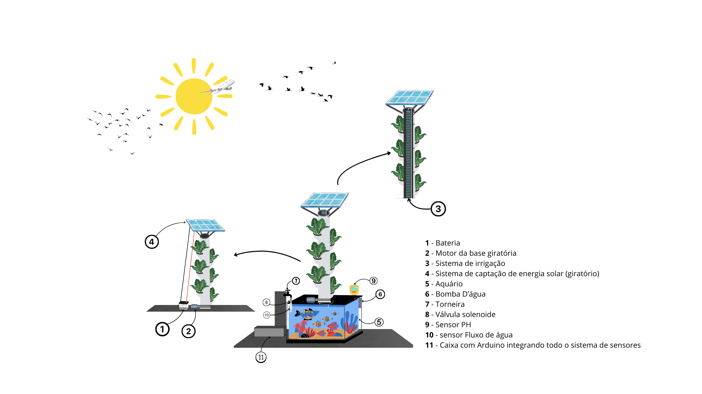

# SmartFish
## Sobre o Projeto SmartFish
O projeto SmartFish é um sistema sustentável que combina um aquário com peixes e
uma horta hidropônica vertical rotativa, visando otimizar o uso de recursos naturais,
promover a reciclagem de nutrientes e automatizar processos relacionados à manutenção
e ao crescimento das plantas e à saúde dos peixes. O sistema utilizará energia solar para
alimentar seus componentes.

### Organograma
Product Owner: Herbert Rocha

SCRUM Master: Eduardo Izidorio

Desenvolvedor: Kevin Willyn

Desenvolvedor: Fernando Rodrigues

Desenvolvedor: Venicius Jacob

## Características do Sistema
- **Monitoramento e Controle Automático:** utiliza microcontroladores Arduino para controlar e monitorar sensores de pH, umidade e temperatura, fluxo e nível de água.
- **Sistema de Energia Solar:** equipado com um módulo giratório de dois eixos que ajusta automaticamente o painel solar, aumentando a eficiência da captação de energia.
- **Sustentabilidade:** redução significativa no consumo de água em comparação com técnicas tradicionais de cultivo.

## Componentes Utilizados
- Arduino Uno e Arduino R3
- Sensores:
  - Sensor de pH
  - Sensor de Umidade e Temperatura DHT11
  - Sensor de Fluxo de Água S201b
  - Sensor de Nível de Água com Boia Horizontal
- Mini bomba d'água 12V RS
- Painel Solar 12V e 1.5W
- Conversor de energia
- Bateria 14V

## Estrutura Física
- Estrutura de PVC com junções em formato de Y
- Reservatório de água integrado ao aquário

## Módulos Principais
### Rastreamento Solar
Utiliza sensores LDR para acompanhar o movimento solar, ajustando o painel solar horizontal e verticalmente através de servomotores controlados pelo Arduino.

### Gerenciamento de Água
Monitoramento automático de níveis de água e irrigação, com ativação da bomba conforme o nível detectado pelo sensor.

## Funcionamento do Código
O código é modular e gerencia as seguintes funções principais:
- Monitoramento contínuo dos parâmetros ambientais e hidráulicos.
- Controle automático da irrigação (1 minuto ligado, 1 minuto desligado).
- Alertas sonoros em casos de falhas no sistema hidráulico.

## Conclusão e Próximos Passos
O projeto validou o conceito de automação sustentável, demonstrando viabilidade técnica e econômica. Futuras implementações podem incluir integração mais robusta de sensores e um dashboard mobile centralizado.

## Imagens

## Como Contribuir
Contribuições são muito bem-vindas! Para contribuir com o projeto:

1. Faça um **fork** deste repositório.
2. Crie uma nova branch com a sua funcionalidade ou correção: `git checkout -b minha-funcionalidade`
3. Realize suas alterações e faça commit: `git commit -m "Minha contribuição"`
4. Envie suas alterações para a sua branch remota: `git push origin minha-funcionalidade`
5. Abra um **Pull Request** explicando as alterações realizadas.

---

### Documentações
[KanBan](https://github.com/users/EhoKira/projects/2)

---

Projeto desenvolvido como parte das atividades acadêmicas do curso de Ciência da Computação da Universidade Federal de Roraima (UFRR), 2025.
